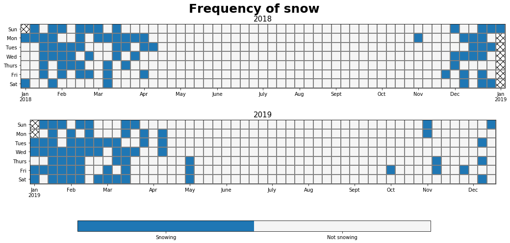
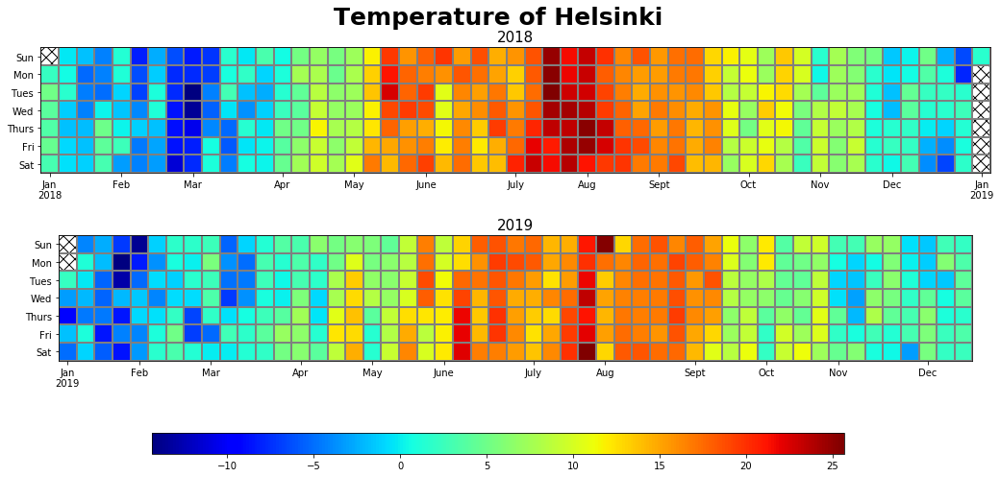

---
authors:
- admin
categories: []
date: "2019-11-31T00:00:00Z"
draft: false
featured: true
image:
  caption: Temperature of Helsinki 2018-2019 measured at Kumpula
  focal_point: Center
projects: []
subtitle: Making calendar heatmap using Python
summary: Beautiful calendar heatmap for annually visualization
tags: ["Python", "visualization"]
title: Calendar heatmap in Python
---
# Table of contents

1. [Intro](#intro)
2. [Categorical variable](#calendar-heatmap-of-helsinki-snowfall)
3. [Continuous variable](#calendar-heatmap-of-helsinki-temperature)

# Intro

Sometimes, I encounter data that has discrete responses that occur in time frame of years. I found that visualize those variables can be quite tricky, such as using scatter plot where all variables lies at different level. In this post, I propose a solution for such problems using calendar heatmap from scratch in Python. This plot can also be used to visualize continuous response, which I will also demonstrate in the second half of this post.

# Load library

```python
import pandas as pd
import numpy as np
import requests
import io
import matplotlib.pyplot as plt
```

# Calendar heatmap of Helsinki snowfall


```python
data_links = 'https://avaa.tdata.fi/smear-services/smeardata.jsp?variables=pwd_smm&table=KUM_META&from=2018-01-01 00:00:00.102&to=2019-12-22 23:59:59.344&quality=ANY&averaging=NONE&type=NONE'

with requests.get(data_links) as response:
    df = response.content
    df = pd.read_csv(io.StringIO(df.decode('utf-8')))
```

A glance of data


```python
print(df)
```

             Year  Month  Day  Hour  Minute  Second  KUM_META.pwd_smm
    0        2018      1    1     0       0       0               0.0
    1        2018      1    1     0       1       0               0.0
    2        2018      1    1     0       2       0               0.0
    3        2018      1    1     0       3       0               0.0
    4        2018      1    1     0       4       0               0.0
    ...       ...    ...  ...   ...     ...     ...               ...
    1038235  2019     12   22    23      55       0               NaN
    1038236  2019     12   22    23      56       0               NaN
    1038237  2019     12   22    23      57       0               NaN
    1038238  2019     12   22    23      58       0               NaN
    1038239  2019     12   22    23      59       0               NaN

    [1038240 rows x 7 columns]


Combined to make column Time in datetime format


```python
df['Time'] = pd.to_datetime(df[['Year', 'Month', 'Day', 'Hour', 'Minute', 'Second']])
df = df.drop(['Year', 'Month', 'Day', 'Hour', 'Minute', 'Second'], axis = 1)
# Rename column to Temp
df.rename(columns = {'KUM_META.pwd_smm' : 'Snow'}, inplace = True)
```

Aggregate daily temperature


```python
df = df.groupby([df['Time'].dt.date]).mean()
df.index = pd.to_datetime(df.index)
```

Masking snow level


```python
df.loc[df.Snow == 0, 'mask'] = "Not snowing"
df.loc[df.Snow != 0, 'mask'] = "Snowing"
```

Calendar heatplot


```python
from matplotlib import colors
# Make dataframe for the calendar plot
value_to_int = {j:i+1 for i,j in enumerate(pd.unique(df['mask'].ravel()))}
df = df.replace(value_to_int)
cal = {'2018': df[df.index.year == 2018], '2019': df[df.index.year == 2019]}
# Define Ticks
DAYS = ['Sun', 'Mon', 'Tues', 'Wed', 'Thurs', 'Fri', 'Sat']
MONTHS = ['Jan', 'Feb', 'Mar', 'Apr', 'May', 'June', 'July', 'Aug', 'Sept', 'Oct', 'Nov', 'Dec']

fig, ax = plt.subplots(2, 1, figsize = (20,6))
for i, val in enumerate(['2018', '2019']):
    start = cal.get(val).index.min()
    end = cal.get(val).index.max()
    start_sun = start - np.timedelta64((start.dayofweek + 1) % 7, 'D')
    end_sun =  end + np.timedelta64(7 - end.dayofweek -1, 'D')

    num_weeks = (end_sun - start_sun).days // 7
    heatmap = np.full([7, num_weeks], np.nan)
    ticks = {}
    y = np.arange(8) - 0.5
    x = np.arange(num_weeks + 1) - 0.5
    for week in range(num_weeks):
        for day in range(7):
            date = start_sun + np.timedelta64(7 * week + day, 'D')
            if date.day == 1:
                ticks[week] = MONTHS[date.month - 1]
            if date.dayofyear == 1:
                ticks[week] += f'\n{date.year}'
            if start <= date < end:
                heatmap[day, week] = cal.get(val).loc[date, 'mask']

    cmap = colors.ListedColormap(['tab:blue', 'whitesmoke'])
    mesh = ax[i].pcolormesh(x, y, heatmap, cmap = cmap, edgecolors = 'grey')

    ax[i].invert_yaxis()
        # Hatch for out of bound values in a year
    ax[i].patch.set(hatch='xx', edgecolor='black')

    # Set the ticks.
    ax[i].set_xticks(list(ticks.keys()))
    ax[i].set_xticklabels(list(ticks.values()))
    ax[i].set_yticks(np.arange(7))
    ax[i].set_yticklabels(DAYS)
    ax[i].set_ylim(6.5,-0.5)
    ax[i].set_aspect('equal')
    ax[i].set_title(val, fontsize = 15)

# Add color bar at the bottom
cbar_ax = fig.add_axes([0.25, -0.10, 0.5, 0.05])
fig.colorbar(mesh, orientation="horizontal", pad=0.2, cax = cbar_ax)
n = len(value_to_int)
colorbar = ax[1].collections[0].colorbar
r = colorbar.vmax - colorbar.vmin
colorbar.set_ticks([colorbar.vmin + r / n * (0.5 + i) for i in range(n)])
colorbar.set_ticklabels(list(value_to_int.keys()))    
fig.suptitle('Frequency of snow', fontweight = 'bold', fontsize = 25)
fig.subplots_adjust(hspace = 0.5)
```





# Calendar heatmap of Helsinki temperature


```python
data_links = 'https://avaa.tdata.fi/smear-services/smeardata.jsp?variables=t&table=KUM_META&from=2018-01-01 00:00:00.112&to=2019-12-31 23:59:59.408&quality=ANY&averaging=NONE&type=NONE'

with requests.get(data_links) as response:
    df = response.content
    df = pd.read_csv(io.StringIO(df.decode('utf-8')))
```

A glance of data


```python
print(df)
```

             Year  Month  Day  Hour  Minute  Second  KUM_META.t
    0        2018      1    1     0       0       0        -0.3
    1        2018      1    1     0       1       0        -0.4
    2        2018      1    1     0       2       0        -0.4
    3        2018      1    1     0       3       0        -0.4
    4        2018      1    1     0       4       0        -0.4
    ...       ...    ...  ...   ...     ...     ...         ...
    1038235  2019     12   22    23      55       0         NaN
    1038236  2019     12   22    23      56       0         NaN
    1038237  2019     12   22    23      57       0         NaN
    1038238  2019     12   22    23      58       0         NaN
    1038239  2019     12   22    23      59       0         NaN

    [1038240 rows x 7 columns]


Combined to make column Time in datetime format


```python
df['Time'] = pd.to_datetime(df[['Year', 'Month', 'Day', 'Hour', 'Minute', 'Second']])
df = df.drop(['Year', 'Month', 'Day', 'Hour', 'Minute', 'Second'], axis = 1)
# Rename column to Temp
df.rename(columns = {'KUM_META.t' : 'Temp'}, inplace = True)
```

Aggregate daily temperature


```python
df = df.groupby([df['Time'].dt.date]).mean()
df.index = pd.to_datetime(df.index)
```

Plot calendar heatmap


```python
from matplotlib import colors

# Turn data frame to a dictionary for easy access
cal = {'2018': df[df.index.year == 2018], '2019': df[df.index.year == 2019]}

# Define Ticks
DAYS = ['Sun', 'Mon', 'Tues', 'Wed', 'Thurs', 'Fri', 'Sat']
MONTHS = ['Jan', 'Feb', 'Mar', 'Apr', 'May', 'June', 'July', 'Aug', 'Sept', 'Oct', 'Nov', 'Dec']

fig, ax = plt.subplots(2, 1, figsize = (20,6))
for i, val in enumerate(['2018', '2019']):
    start = cal.get(val).index.min()
    end = cal.get(val).index.max()
    start_sun = start - np.timedelta64((start.dayofweek + 1) % 7, 'D')
    end_sun =  end + np.timedelta64(7 - end.dayofweek -1, 'D')

    num_weeks = (end_sun - start_sun).days // 7
    heatmap = np.full([7, num_weeks], np.nan)    
    ticks = {}
    y = np.arange(8) - 0.5
    x = np.arange(num_weeks + 1) - 0.5
    for week in range(num_weeks):
        for day in range(7):
            date = start_sun + np.timedelta64(7 * week + day, 'D')
            if date.day == 1:
                ticks[week] = MONTHS[date.month - 1]
            if date.dayofyear == 1:
                ticks[week] += f'\n{date.year}'
            if start <= date < end:
                heatmap[day, week] = cal.get(val).loc[date, 'Temp']
    mesh = ax[i].pcolormesh(x, y, heatmap, cmap = 'jet', edgecolors = 'grey')

    ax[i].invert_yaxis()

    # Set the ticks.
    ax[i].set_xticks(list(ticks.keys()))
    ax[i].set_xticklabels(list(ticks.values()))
    ax[i].set_yticks(np.arange(7))
    ax[i].set_yticklabels(DAYS)
    ax[i].set_ylim(6.5,-0.5)
    ax[i].set_aspect('equal')
    ax[i].set_title(val, fontsize = 15)

    # Hatch for out of bound values in a year
    ax[i].patch.set(hatch='xx', edgecolor='black')

# Add color bar at the bottom
cbar_ax = fig.add_axes([0.25, -0.10, 0.5, 0.05])
fig.colorbar(mesh, orientation="horizontal", pad=0.2, cax = cbar_ax)
colorbar = ax[1].collections[0].colorbar
r = colorbar.vmax - colorbar.vmin
fig.suptitle('Temperature of Helsinki', fontweight = 'bold', fontsize = 25)
fig.subplots_adjust(hspace = 0.5)
```



