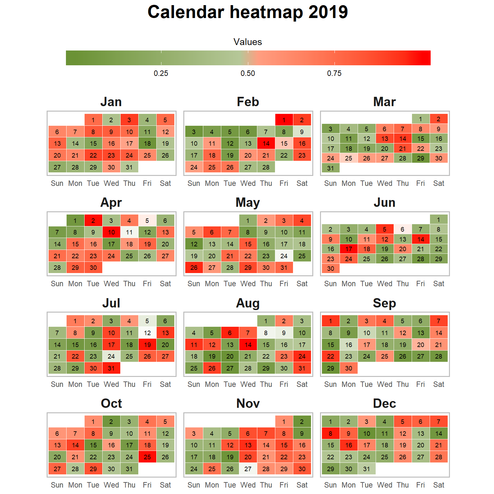

# Intro

There are many packages outthere that can create a calendar heatmap. Most of them are usually in an format that is efficient for analysis overview but not so easy for a normal person to comprehend at first glance like the following graph: 


The aim of this post is to create a calendar heatmap that has the format exactly like a normal caldendar like this:




# Calendar heatmap

Load library

```{r message=FALSE}
library(tidyverse) # contains ggplot2 (for plot) and dplyr (for easy data manipulation)
library(lubridate) # For date and time manipulation
```

Create some data for the heatmap

```{r}
df  <-  tibble(
  DateCol = seq(
    dmy("01/01/2019"),
    dmy("31/12/2019"),
    "days"
  ),
  ValueCol = runif(365)
)
```

In order to plot calendar, the following varriables need to be obtained:

- Week date

- Week of the month

- Week of the year

- Month of the year

- Date of the year

Save the transformed data.

```{r}
dfPlot <- df %>% 
  mutate(weekday = wday(DateCol, label = T, week_start = 7), # can put week_start = 1 to start week on Monday
         month = month(DateCol, label = T),
         date = yday(DateCol),
         week = epiweek(DateCol))

# isoweek makes the last week of the year as week 1, so need to change that to week 53 for the plot
dfPlot$week[dfPlot$month=="Dec" & dfPlot$week ==1] = 53 

dfPlot <- dfPlot %>% 
  group_by(month) %>% 
  mutate(monthweek = 1 + week - min(week))
```

Plot

```{r}
dfPlot %>%  
  ggplot(aes(weekday,-week, fill = ValueCol)) +
  geom_tile(colour = "white")  + 
  theme(aspect.ratio = 1/5,
        axis.title.x = element_blank(),
        axis.title.y = element_blank(),
        axis.text.y = element_blank(),
        panel.grid = element_blank(),
        axis.ticks = element_blank(),
        panel.background = element_blank(),
        strip.background = element_blank(),
        strip.text = element_text(face = "bold", size = 15),
        panel.border = element_rect(colour = "black", fill=NA, size=1)) +
  facet_wrap(~month, nrow = 4, ncol = 3, scales = "free") 
```

Create better color scale for easy visualization and add the date of the month to the graph

```{r fig.height=8, fig.width=8}
dfPlot %>%
  ggplot(aes(weekday,-week, fill = ValueCol)) +
  geom_tile(colour = "white")  + 
  geom_text(aes(label = day(DateCol)), size = 3) +
  theme(aspect.ratio = 1/2,
        axis.title.x = element_blank(),
        axis.title.y = element_blank(),
        axis.text.y = element_blank(),
        panel.grid = element_blank(),
        axis.ticks = element_blank(),
        panel.background = element_blank(),
        strip.background = element_blank(),
        strip.text = element_text(face = "bold", size = 15),
        panel.border = element_rect(colour = "black", fill=NA, size=1)) +
  scale_fill_gradient2(midpoint = 0.5) +
  facet_wrap(~month, nrow = 4, ncol = 3, scales = "free") +
  labs(title = "Calendar heatmap 2019")
```

# Final graph

```{r calendarheatmap,fig.height=8, fig.width=8}
dfPlot %>%
  ggplot(aes(weekday,-week, fill = ValueCol)) +
  geom_tile(colour = "white")  + 
  geom_text(aes(label = day(DateCol)), size = 2.5, color = "black") +
  theme(aspect.ratio = 1/2,
        legend.position = "top",
        legend.key.width = unit(3, "cm"),
        axis.title.x = element_blank(),
        axis.title.y = element_blank(),
        axis.text.y = element_blank(),
        panel.grid = element_blank(),
        axis.ticks = element_blank(),
        panel.background = element_blank(),
        legend.title.align = 0.5,
        strip.background = element_blank(),
        strip.text = element_text(face = "bold", size = 15),
        panel.border = element_rect(colour = "grey", fill=NA, size=1),
        plot.title = element_text(hjust = 0.5, size = 21, face = "bold",
                                  margin = margin(0,0,0.5,0, unit = "cm"))) +
  scale_fill_gradientn(colours = c("#6b9235", "white", "red"),
                       values = scales::rescale(c(-1, -0.05, 0, 0.05, 1)), 
                       name = "Values",
                       guide = guide_colorbar(title.position = "top", 
                                              direction = "horizontal")) +
  facet_wrap(~month, nrow = 4, ncol = 3, scales = "free") +
  labs(title = "Calendar heatmap 2019")
```

