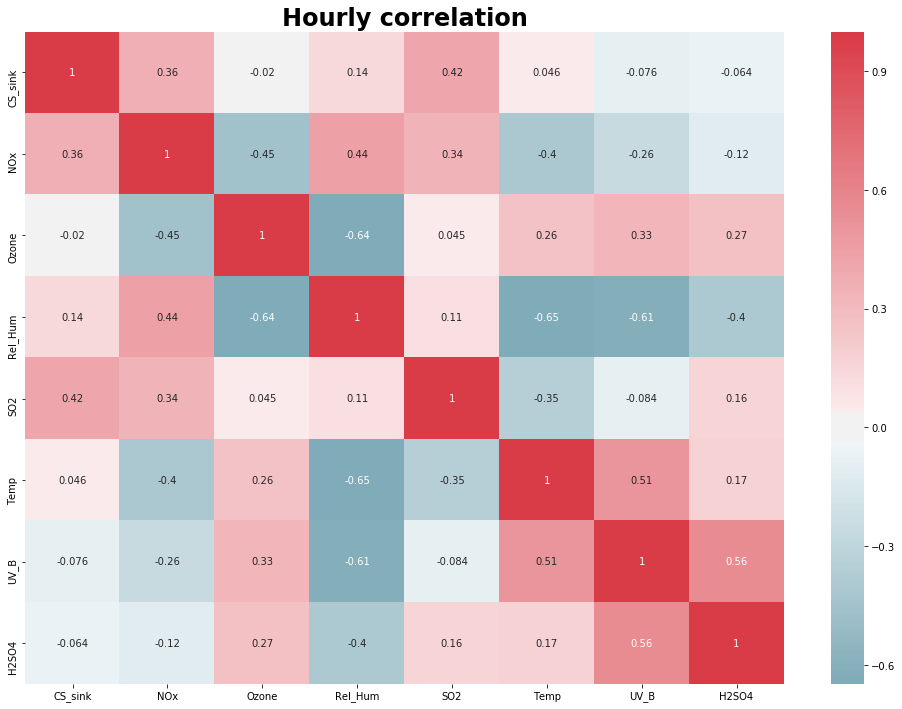
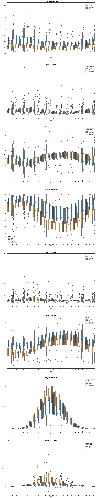

---
authors:
- admin
categories: []
date: "2019-10-31T00:00:00Z"
draft: false
featured: true
image:
  caption: Hourly correlation of gases
  focal_point: Smart
projects: []
subtitle: Data collected at SmearII station in Hyytiälä, Finland
summary: Analyze new particle formation in connections with other gases
tags: ["Python"]
title: New particle formation in Hyytiälä
links:
  - icon_pack: fab
    icon: github
    name: Full code at Github
    url: 'https://github.com/vietle94/NPF-smearII'
---
# Table of contents

1. [Load libraries](#load-libraries)
2. [Check data](#check-data)
3. [Load data](#load-data)
4. [Preprocess](#preprocess)
5. [Remove outliers](#remove-outliers)
6. [Aggregate data and add proxy variable](#aggregate-data)
7. [Event frequency](#event-frequency)
8. [Correlation plot](#correlation-plot)
9. [Cross-correlation](#cross-correlation)
10. [Time-series plot](#time-series-plot)
11. [Seasonal pattern based on Event](#seasonal-pattern-based-on-Event)
12. [Diurnal pattern based on Event](#diurnal-pattern-based-on-Event)
13. [Check normality assumptions of all parameters for each Event category](#check-normality-assumptions-of-all-parameters-for-each-Event-category)
14. [Kruskal-Wallis test](#kruskal-Wallis-test)
15. [PCA](#pca)
16. [K-nearest neighbor](#k-nearest-neighbor)

# Intro

One of the major uncertainties in predicting the Earth's climate are the atmospheric aerosol particles. Being highly variable in space and time, aerosols are very difficult to quantify exactly. This leads to uncertainties in understanding the radiative balance in the atmosphere and predicting precipitation. While primary emissions are huge sources of aerosols particles, New Particle Formation (NPF) is one of the major sources of increase in the particle number in the atmosphere and are seen to occur in diverse atmospheric conditions.

This is the analyses that I made together with Steven Job Thomas. Full report can be found in the beginning by clicking the PDF button, also full code and be found at my github page (also in the beginning of this page).

# Load libraries


```python
import pandas as pd
import numpy as np
import matplotlib.pyplot as plt
import matplotlib.dates
import seaborn as sns
```

# Load data


```python
df_raw = pd.read_csv('fulldata.csv', parse_dates = ['Time'])
df_raw.columns = [x if x == "Time" else x[9:] for x in df_raw.columns] # Remove unnecessary part in default column names
df_raw.rename(columns = {'NOx168' : 'NOx', 'O3168' : 'O3', 'RHIRGA168' : 'Rel_Hum', 'O3168': 'Ozone', 'T168' : 'Temp', 'SO2168' : 'SO2'}, inplace = True)
```


```python
event = pd.read_csv('Event_classification_2004-2014.csv') # Load event data
event['Time'] = pd.to_datetime(event.Date, format = "%d-%b-%Y")
event.drop('Date', axis = 1, inplace = True)

condense_raw = pd.read_csv('CS_2004_2014.csv') # Load condensation sink data
condense_raw['Time'] = pd.to_datetime(condense_raw.times, format = "%d-%b-%Y %H:%M:%S")
condense_raw.drop('times', axis = 1, inplace = True)
condense_raw.rename(columns = {'Condensation_sink': 'CS_sink'}, inplace = True)
```

### Get data from 2008 & 2009


```python
condense_raw = condense_raw[(condense_raw.Time >= pd.Timestamp(2008,1,1)) & (condense_raw.Time < pd.Timestamp(2010,1,1))]
event = event[(event.Time >= pd.Timestamp(2008,1,1)) & (event.Time < pd.Timestamp(2010,1,1))]
condense_raw.reset_index(drop = True, inplace = True)
event.reset_index(drop = True, inplace = True)
```


```python
# Make a dictionary of variable's names with correct unit.
# Each time a variable is plotted, the correct unit will be extract from this dictionary for labelling
unit = {'CS_sink' : '$s^{-1}$' , 'Rel_Hum' : '%', 'Temp' : '$^\circ C$', 'Ozone' : 'ppb',
       'NOx' : 'ppb', 'SO2' : 'ppb','UV_B' : '$W m^{-2}$', 'H2SO4' : '$cm^{-3}$'}
```

# Check data

## Parameters data


```python
print(df_raw.head())
```

                     Time   NOx  Ozone  Rel_Hum   SO2  Temp    UV_B
    0 2008-01-01 00:00:00   NaN    NaN      NaN   NaN -1.79 -0.0003
    1 2008-01-01 00:01:00   NaN    NaN      NaN   NaN -1.81  0.0002
    2 2008-01-01 00:02:00   NaN    NaN      NaN   NaN -1.80  0.0002
    3 2008-01-01 00:03:00  0.57  26.57    85.59 -0.02 -1.84  0.0002
    4 2008-01-01 00:04:00   NaN    NaN      NaN   NaN -1.84  0.0006


#### Overall statistics


```python
print(df_raw.describe())
```

                     NOx          Ozone        Rel_Hum            SO2  \
    count  171339.000000  171201.000000  164762.000000  171681.000000   
    mean        1.235275      29.356992      76.981689       0.188140   
    std         1.593818      10.731424      18.947285       0.381855   
    min        -0.220000      -0.930000      16.330000      -0.220000   
    25%         0.290000      21.730000      64.870000       0.030000   
    50%         0.670000      28.810000      84.560000       0.090000   
    75%         1.610000      36.170000      92.070000       0.210000   
    max        57.450000      82.590000     105.650000      36.420000   

                   Temp          UV_B  
    count  1.039150e+06  1.045704e+06  
    mean   4.489560e+00  2.476934e-01  
    std    8.450221e+00  4.978083e-01  
    min   -2.005000e+01 -6.100000e-03  
    25%   -1.550000e+00  0.000000e+00  
    50%    3.650000e+00  6.100000e-03  
    75%    1.148000e+01  2.215000e-01  
    max    2.789000e+01  3.216400e+00  


#### Check NA values


```python
# There are plenty of missing values,
# significant difference in number of missing values is from the difference in sampling frequency
df_raw.isna().sum()
```


    Time            0
    NOx        881301
    Ozone      881439
    Rel_Hum    887878
    SO2        880959
    Temp        13490
    UV_B         6936
    dtype: int64


## Event data

#### First glance


```python
print(event.head())
```

       Type Ia  Type Ib  Type II  Type Apple  Type Bump  Type Rain  \
    0        0        0        0           0          0          0   
    1        0        0        0           0          0          0   
    2        0        0        0           0          0          0   
    3        0        0        0           0          0          0   
    4        0        0        0           0          0          0   

       Type Featureless  Nonevent  Undefined       Time  
    0                 0         1          0 2008-01-01  
    1                 0         0          1 2008-01-02  
    2                 0         0          0 2008-01-03  
    3                 0         0          1 2008-01-04  
    4                 0         1          0 2008-01-05  


#### General statistics


```python
print(event.describe())
```

              Type Ia     Type Ib     Type II  Type Apple  Type Bump  Type Rain  \
    count  731.000000  731.000000  731.000000       731.0      731.0      731.0   
    mean     0.004104    0.047880    0.151847         0.0        0.0        0.0   
    std      0.063974    0.213658    0.359118         0.0        0.0        0.0   
    min      0.000000    0.000000    0.000000         0.0        0.0        0.0   
    25%      0.000000    0.000000    0.000000         0.0        0.0        0.0   
    50%      0.000000    0.000000    0.000000         0.0        0.0        0.0   
    75%      0.000000    0.000000    0.000000         0.0        0.0        0.0   
    max      1.000000    1.000000    1.000000         0.0        0.0        0.0   

           Type Featureless    Nonevent   Undefined  
    count             731.0  731.000000  731.000000  
    mean                0.0    0.313269    0.454172  
    std                 0.0    0.464141    0.498236  
    min                 0.0    0.000000    0.000000  
    25%                 0.0    0.000000    0.000000  
    50%                 0.0    0.000000    0.000000  
    75%                 0.0    1.000000    1.000000  
    max                 0.0    1.000000    1.000000  


#### Frequency of each event in the period 2008-2009


```python
event.sum(axis = 0) # Those type never occurred in this period will be removed
```

    Type Ia               3
    Type Ib              35
    Type II             111
    Type Apple            0
    Type Bump             0
    Type Rain             0
    Type Featureless      0
    Nonevent            229
    Undefined           332
    dtype: int64


#### Check NA values


```python
event.isna().sum()
```


    Type Ia             0
    Type Ib             0
    Type II             0
    Type Apple          0
    Type Bump           0
    Type Rain           0
    Type Featureless    0
    Nonevent            0
    Undefined           0
    Time                0
    dtype: int64


#### Let's check whether each event is marked only as 1 and 0 or if there is any hidden value


```python
# Sometimes, in old data design, missing values are marked as an arbitrary number like 99, just double check
for col in event.iloc[:,:-1]:
    print(col, event[col].unique())
```

    Type Ia [0 1]
    Type Ib [0 1]
    Type II [0 1]
    Type Apple [0]
    Type Bump [0]
    Type Rain [0]
    Type Featureless [0]
    Nonevent [1 0]
    Undefined [0 1]


#### Check if each day, there is only one event


```python
event.sum(axis = 1).unique()
# To check if there is more than one event in a day or data input mistake which mark 'event' and 'nonevent' on the same day
```


    array([1, 0], dtype=int64)


## Condense

#### First glance


```python
print(condense_raw.head())
```

        CS_sink                Time
    0  0.001787 2008-01-01 00:09:45
    1  0.001710 2008-01-01 00:19:45
    2  0.001514 2008-01-01 00:29:46
    3  0.001527 2008-01-01 00:39:45
    4  0.001554 2008-01-01 00:49:46


#### General statistics


```python
print(condense_raw.describe())
```

                 CS_sink
    count  102540.000000
    mean        0.003777
    std         0.003240
    min         0.000006
    25%         0.001818
    50%         0.003016
    75%         0.004813
    max         0.325251


#### Check NA values


```python
condense_raw.isna().sum()
```


    CS_sink    1158
    Time          0
    dtype: int64


# Preprocess

### Event data
#### Let's drop Type Apple, Type Bump, Type Rain and Type Featureless due to no data


```python
event.drop(['Type Apple', 'Type Rain', 'Type Bump', 'Type Featureless'], axis = 1, inplace = True)
```

#### New variabable that combines all events and then remove all those event it replaces


```python
event['Event'] = event['Type Ia'] + event['Type Ib'] + event['Type II']
event.drop(['Type Ia', 'Type Ib', 'Type II'], axis = 1, inplace = True)
```

#### Replace Event, Nonevent, and Undefined columns by Event_category column


```python
condition = [event.Event == 1, event.Nonevent == 1]
choice = ['Event', 'Nonevent']
event['Event_category'] = np.select(condition, choice, default = 'Undefined')
event.drop(['Nonevent', 'Event', 'Undefined'], axis = 1, inplace = True)
```

### Remove outlier for condense and parameters df

#### Time-series of each parameter


```python
fig, axe = plt.subplots(df_raw.shape[1] - 1,1, figsize = (15, 30))
axe = axe.flatten()
for i in range(1, df_raw.shape[1]):
    axe[i-1].scatter(df_raw.Time, df_raw.iloc[:,i])
    axe[i-1].set_title(df_raw.columns[i])
    axe[i-1].set_ylabel(unit.get(df_raw.columns[i]))
    axe[i-1].xaxis.set_major_locator(matplotlib.dates.MonthLocator(bymonth=12, bymonthday=1, interval=1, tz=None))

fig.subplots_adjust(left=None, bottom=None, right=None, top=None, wspace=None, hspace=0.5)
```

    C:\Users\VIET\Anaconda3\lib\site-packages\pandas\plotting\_matplotlib\converter.py:103: FutureWarning: Using an implicitly registered datetime converter for a matplotlib plotting method. The converter was registered by pandas on import. Future versions of pandas will require you to explicitly register matplotlib converters.

    To register the converters:
    	>>> from pandas.plotting import register_matplotlib_converters
    	>>> register_matplotlib_converters()
      warnings.warn(msg, FutureWarning)


```python
df_raw.boxplot(figsize = (15, 7))
```


    <matplotlib.axes._subplots.AxesSubplot at 0x1b4ddcf1a20>


Detecting outlier using boxplot for the raw time-series of two years is not ideal because:

- Time-series are usually not stationary

- If the values only peak during a short time of every year (for example during the last week of every winter), then only a small set of data have such a high values (because there are 53 weeks in a year). As a result, the boxplot will consider those as outlier.

Instead, detecting outlier based on the distribution of the differences between two consecutive observations is a better idea. We wil make a function to remove outlier by first compute the distribution of diffences between two consecutive values. Then those differences that have $ \left | Zscore  \right |$ larger than 1.96 (corresponding to within 95% of the distribution) will be considered as outlier. In simple words, the fluctuation between consecutive values will be removed (put as NaN) if they are too large in their distribution.


```python
# Remove outlier based on quantile
#def remove_outlier_quantile(dataframe, quantile = 0.95, timecolumn = 'Time'):
#    data = dataframe.copy(deep = True)
#    for col in data:
#        if col not in [timecolumn]:
#            column_nona = data.loc[~data[col].isna(), col]
#            delta = column_nona - column_nona.shift(1)
#            q = delta.quantile(quantile)
#            idx = delta[delta > q].index
#            data.loc[idx, col] = np.NaN
#    return data
```


```python
# Remove outlier based on zscore
def remove_outlier(dataframe, zscore = 1.96, timecolumn = 'Time'):
    from scipy import stats
    data = dataframe.copy(deep = True)
    for col in data:
        if col not in [timecolumn]:
            column_nona = data.loc[~data[col].isna(), col]
            delta = column_nona - column_nona.shift(1)
            delta.iloc[0] = np.nanmean(delta) # To include first value of the time series
            abs_zscore = np.abs(stats.zscore(delta))
            idx = delta[abs_zscore > zscore].index
            data.loc[idx, col] = np.NaN
    return data
```

# Remove outliers


```python
df_processed = remove_outlier(df_raw)

condense_processed = remove_outlier(condense_raw)
```


```python
fig, axe = plt.subplots(df_raw.shape[1] + 1,2, figsize = (15, 30), gridspec_kw={"height_ratios":np.append(0.005, np.repeat(1,df_raw.shape[1]))})

# Make titles for each column of plot
axe[0,0].axis('off')
axe[0,0].set_title('Removed ouliers data', fontweight='bold', fontsize = 20)
axe[0,1].axis('off')
axe[0,1].set_title('Raw data', fontweight='bold', fontsize = 20)

# Plot
for i in range(1, df_raw.shape[1]):
    axe[i, 0].scatter(df_processed.Time, df_processed.iloc[:,i])
    axe[i, 0].set_title(df_processed.columns[i])
    axe[i, 0].set_ylabel(unit.get(df_processed.columns[i]))
    axe[i, 0].xaxis.set_major_locator(matplotlib.dates.MonthLocator(bymonth=12, bymonthday=1, interval=1, tz=None))
    axe[i, 1].scatter(df_raw.Time, df_raw.iloc[:,i])
    axe[i, 1].set_title(df_raw.columns[i])
    axe[i, 1].set_ylabel(unit.get(df_raw.columns[i]))
    axe[i, 1].xaxis.set_major_locator(matplotlib.dates.MonthLocator(bymonth=12, bymonthday=1, interval=1, tz=None))    

axe[df_raw.shape[1] , 0].scatter(condense_processed.Time, condense_processed.CS_sink)
axe[df_raw.shape[1] , 0].set_title('CS_sink')
axe[df_raw.shape[1] , 0].set_ylabel(unit.get('CS_sink'))
axe[df_raw.shape[1] , 0].xaxis.set_major_locator(matplotlib.dates.MonthLocator(bymonth=12, bymonthday=1, interval=1, tz=None))
axe[df_raw.shape[1] , 1].scatter(condense_raw.Time, condense_raw.CS_sink)
axe[df_raw.shape[1] , 1].set_title('CS_sink')
axe[df_raw.shape[1] , 1].set_ylabel(unit.get('CS_sink'))
axe[df_raw.shape[1] , 1].xaxis.set_major_locator(matplotlib.dates.MonthLocator(bymonth=12, bymonthday=1, interval=1, tz=None))

fig.subplots_adjust(left=None, bottom=0.1, right=None, top=None, wspace=None, hspace=0.5)
```


# Aggregate data

#### Calculate hourly data


```python
# Aggregate data by hour and take the mean of all observation within each hour
condense_hourly = condense_processed.groupby([condense_processed["Time"].dt.date,condense_processed["Time"].dt.hour]).mean()
df_hourly = df_processed.groupby([df_processed["Time"].dt.date,df_processed["Time"].dt.hour]).mean()
# Join data together
combined_hourly = condense_hourly.join(df_hourly)
combined_hourly.index.rename(['Time', 'Hour'], inplace = True)
# Join with event data set
event = event.set_index('Time')
combined_hourly =event.join(combined_hourly)
```

#### Calculate daily data


```python
# Aggregate data by date and take the mean of all observation within each date
condense_daily = condense_processed.groupby([condense_processed["Time"].dt.date]).mean()
df_daily = df_processed.groupby([df_processed["Time"].dt.date]).mean()
# Join data
combined_daily = event.join(condense_daily).join(df_daily)
```

# Add proxy

$[H_2SO_4]_{proxy} = k \cdot \frac{[SO_2][UVB]}{CS}$


```python
combined_daily['H2SO4'] = combined_daily['SO2'] * combined_daily['UV_B'] * 9.9e-7 / combined_daily['CS_sink'] * 2.62e-6 / 64 * 6.023e23 / 1e6
combined_hourly['H2SO4'] = combined_hourly['SO2'] * combined_hourly['UV_B'] * 9.9e-7 / combined_hourly['CS_sink'] * 2.62e-6 / 64 * 6.023e23 / 1e6
```

# Analysis

# Event frequency


```python
from matplotlib import colors
# Make dataframe for the calendar plot
value_to_int = {j:i+1 for i,j in enumerate(pd.unique(event.values.ravel()))}
event_cal = event.replace(value_to_int)
cal = {'2008': event_cal[event_cal.index.year == 2008], '2009': event_cal[event_cal.index.year == 2009]}
# Define Ticks
DAYS = ['Sun', 'Mon', 'Tues', 'Wed', 'Thurs', 'Fri', 'Sat']
MONTHS = ['Jan', 'Feb', 'Mar', 'Apr', 'May', 'June', 'July', 'Aug', 'Sept', 'Oct', 'Nov', 'Dec']

fig, ax = plt.subplots(2, 1, figsize = (20,6))
for i, val in enumerate(['2008', '2009']):
    start = cal.get(val).index.min()
    end = cal.get(val).index.max()
    start_sun = start - np.timedelta64((start.dayofweek + 1) % 7, 'D')
    end_sun =  end + np.timedelta64(7 - end.dayofweek -1, 'D')

    num_weeks = (end_sun - start_sun).days // 7
    heatmap = np.zeros((7, num_weeks))
    ticks = {}
    y = np.arange(8) - 0.5
    x = np.arange(num_weeks + 1) - 0.5
    for week in range(num_weeks):
        for day in range(7):
            date = start_sun + np.timedelta64(7 * week + day, 'D')
            if date.day == 1:
                ticks[week] = MONTHS[date.month - 1]
            if date.dayofyear == 1:
                ticks[week] += f'\n{date.year}'
            if start <= date < end:
                heatmap[day, week] = cal.get(val).loc[date, 'Event_category']

    cmap = colors.ListedColormap(['gray', 'tab:blue', 'whitesmoke', 'tab:orange'])
    mesh = ax[i].pcolormesh(x, y, heatmap, cmap = cmap, edgecolors = 'grey')

    ax[i].invert_yaxis()

    # Set the ticks.
    ax[i].set_xticks(list(ticks.keys()))
    ax[i].set_xticklabels(list(ticks.values()))
    ax[i].set_yticks(np.arange(7))
    ax[i].set_yticklabels(DAYS)
    ax[i].set_ylim(6.5,-0.5)
    ax[i].set_aspect('equal')
    ax[i].set_title(val, fontsize = 15)
# Add color bar at the bottom
cbar_ax = fig.add_axes([0.25, -0.10, 0.5, 0.05])
fig.colorbar(mesh, orientation="horizontal", pad=0.2, cax = cbar_ax)
n = len(value_to_int) +1
colorbar = ax[1].collections[0].colorbar
r = colorbar.vmax - colorbar.vmin
colorbar.set_ticks([colorbar.vmin + r / n * (0.5 + i) for i in range(n)])
colorbar.set_ticklabels(['Outofbound'] + list(value_to_int.keys()))    
fig.suptitle('Frequency of events', fontweight = 'bold', fontsize = 25)
fig.subplots_adjust(hspace = 0.5)
```


# Correlation plot

```python
fig, ax = plt.subplots(figsize = (17,12))
sns.heatmap(combined_hourly.corr(), cmap = cmap, center=0.00, ax = ax, annot = True)
ax.set_ylim(combined_hourly.shape[1]-1,0)
ax.set_title('Hourly correlation', weight = "bold", fontsize=24)
```




```python
fig, ax = plt.subplots(1, 2, figsize = (20,8))
sns.heatmap(combined_daily[combined_daily.Event_category == 'Event'].corr(), cmap = cmap, center=0.00, ax = ax[0], annot = True, cbar = False)
ax[0].set_ylim(combined_daily.shape[1]-1,0)
ax[0].set_title('Daily correlation on Event day', weight = "bold", fontsize=24)
sns.heatmap(combined_daily[combined_daily.Event_category == 'Nonevent'].corr(), cmap = cmap, center=0.00, ax = ax[1], annot = True, cbar = True)
ax[1].set_ylim(combined_daily.shape[1]-1,0)
ax[1].set_title('Daily correlation on Non-Event day', weight = "bold", fontsize=24)
```


    Text(0.5, 1, 'Daily correlation on Non-Event day')


# Cross-correlation


```python
# Make an empty matrix n x n with n is the number of parameters.
cross_correlation = np.zeros((combined_hourly.shape[1] - 1, combined_hourly.shape[1] - 1))
# Loop all values in the matrix and compute the corresponding time-lag
for ii, i in enumerate(combined_hourly.columns[1:]):
    for jj, j in enumerate(combined_hourly.columns[1:]):
        if j != i:
            pair = combined_hourly[[i, j]].dropna(axis = 0)
            c = np.correlate(pair[i], pair[j], mode = 'full')
            icmax = np.argmax(c)
            tlag = -1 * (icmax - len(pair[i]) +1)
            cross_correlation[ii,jj] = tlag
# Plot heatmap of the matrix
fig, ax = plt.subplots(figsize = (17,12))
sns.heatmap(cross_correlation.astype(int), xticklabels = combined_hourly.columns[1:], yticklabels = combined_hourly.columns[1:], ax = ax, annot = True, fmt="d", cmap = cmap)
ax.set_ylim(combined_hourly.shape[1] -1 ,0)
fig.suptitle('Cross correlation between all parameters', fontweight = 'bold', size = 22)
ax.set_title('Value of each cell is time lag (hour)')
```


    Text(0.5, 1, 'Value of each cell is time lag (hour)')


Cross-correlation is a measure of similarity of two time-series as a function of a time-lag applied to one of them. In this result, those pairs of parameters that have time-lag too far away from 0 is probably not similar

# Time-series plot


```python
fig, axe = plt.subplots(combined_daily.shape[1]-1, figsize = (15, 30))
for i in range(combined_daily.shape[1]-1):
    axe[i].plot(combined_daily[combined_daily.Event_category == 'Event'].iloc[:,i+1],'.', markersize = 8 ,label = 'Event day')
    axe[i].plot(combined_daily[combined_daily.Event_category == 'Nonevent'].iloc[:,i+1], '.' , markersize = 8,c = 'red', label = 'Nonevent day')
#    axe[i].plot(combined_daily[combined_daily.Event_category == 'Undefined'].iloc[:,i+1], c = 'green', marker = '.', label = 'Undefined day')
    axe[i].set_title(combined_daily.columns[i+1], fontweight = 'bold')
    axe[i].set_ylabel(unit.get(combined_daily.columns[i+1]))
    axe[i].xaxis.set_major_locator(matplotlib.dates.MonthLocator(bymonth=12, bymonthday=1, interval=1, tz=None))
    axe[i].legend()

fig.subplots_adjust(left=None, bottom=None, right=None, top=None, wspace=None, hspace=0.5)
```


# Seasonal pattern based on Event


```python
fig, ax = plt.subplots(combined_daily.shape[1] - 1, figsize = (15, 55))
for i in range(combined_daily.shape[1] - 1):
    sns.boxplot(x = combined_daily.index.month, y = combined_daily.iloc[:,i+1], hue = combined_daily['Event_category'], palette = {'Nonevent' : 'tab:blue', 'Undefined' : 'whitesmoke', 'Event' : 'tab:orange'}, hue_order = ['Event', 'Nonevent', 'Undefined'], ax = ax[i])
    ax[i].set_title(combined_daily.columns[i+1], fontweight = 'bold')
    ax[i].set_xlabel('Month')
    ax[i].set_ylabel(unit.get(combined_daily.columns[i+1]))    
    ax[i].set_xticklabels(MONTHS)

fig.subplots_adjust(left=None, bottom=None, right=None, top=None, wspace=None, hspace=0.5)
```


# Diurnal pattern based on Event

#### WINTER


```python
winter = [12,1,2,3] # Define months of winter
idx = np.in1d(combined_hourly.index.get_level_values('Time').month, winter)
fig, ax = plt.subplots(combined_hourly.shape[1] - 1, figsize = (15, 85))
for i in range(combined_hourly.shape[1] - 1):
    sns.boxplot(x = combined_hourly[idx].index.get_level_values('Hour'), y = combined_hourly[idx].iloc[:,i+1], hue = combined_hourly.loc[idx,'Event_category'], palette = {'Nonevent' : 'tab:blue', 'Undefined' : 'whitesmoke', 'Event' : 'tab:orange'}, hue_order = ['Event', 'Nonevent', 'Undefined'], ax = ax[i])
    ax[i].set_title(combined_daily.columns[i+1] + ' in winter', fontweight = 'bold')
    ax[i].set_ylabel(unit.get(combined_daily.columns[i+1]))
    ax[i].set_xlabel('Hour')    
```


#### SPRING


```python
spring = [4, 5] # Define months of spring
idx = np.in1d(combined_hourly.index.get_level_values('Time').month, spring)
fig, ax = plt.subplots(combined_hourly.shape[1] - 1, figsize = (15, 85))
for i in range(combined_hourly.shape[1] - 1):
    sns.boxplot(x = combined_hourly[idx].index.get_level_values('Hour'), y = combined_hourly[idx].iloc[:,i+1], hue = combined_hourly.loc[idx,'Event_category'], palette = {'Nonevent' : 'tab:blue', 'Undefined' : 'whitesmoke', 'Event' : 'tab:orange'}, hue_order = ['Event', 'Nonevent', 'Undefined'], ax = ax[i])
    ax[i].set_title(combined_daily.columns[i+1] + ' in spring', fontweight = 'bold')
    ax[i].set_xlabel('Hour')   
    ax[i].set_ylabel(unit.get(combined_daily.columns[i+1]))
```


#### SUMMER


```python
summer = [6,7,8] # # Define months of summer
idx = np.in1d(combined_hourly.index.get_level_values('Time').month, summer)
fig, ax = plt.subplots(combined_hourly.shape[1] - 1, figsize = (15, 85))
for i in range(combined_hourly.shape[1] - 1):
    sns.boxplot(x = combined_hourly[idx].index.get_level_values('Hour'), y = combined_hourly[idx].iloc[:,i+1], hue = combined_hourly.loc[idx,'Event_category'], palette = {'Nonevent' : 'tab:blue', 'Undefined' : 'whitesmoke', 'Event' : 'tab:orange'}, hue_order = ['Event', 'Nonevent', 'Undefined'], ax = ax[i])
    ax[i].set_title(combined_daily.columns[i+1] + ' in summer', fontweight = 'bold')
    ax[i].set_xlabel('Hour')   
    ax[i].set_ylabel(unit.get(combined_daily.columns[i+1]))
```





#### AUTUMN


```python
autumn = [9,10,11] # # Define months of autumn
idx = np.in1d(combined_hourly.index.get_level_values('Time').month, autumn)
fig, ax = plt.subplots(combined_hourly.shape[1] - 1, figsize = (15, 85))
for i in range(combined_hourly.shape[1] - 1):
    sns.boxplot(x = combined_hourly[idx].index.get_level_values('Hour'), y = combined_hourly[idx].iloc[:,i+1], hue = combined_hourly.loc[idx,'Event_category'], palette = {'Nonevent' : 'tab:blue', 'Undefined' : 'whitesmoke', 'Event' : 'tab:orange'}, hue_order = ['Event', 'Nonevent', 'Undefined'], ax = ax[i])
    ax[i].set_title(combined_daily.columns[i+1] + ' in autumn', fontweight = 'bold')
    ax[i].set_xlabel('Hour')    
    ax[i].set_ylabel(unit.get(combined_daily.columns[i+1]))
```


# Check normality assumptions of all parameters for each Event category


```python
fig, ax = plt.subplots(4,2, figsize = (15,10))
ax = ax.flatten()
for i, ax in enumerate(ax):
    ax.hist(combined_daily[combined_daily['Event_category'] == 'Nonevent'].iloc[:,i+1])
    ax.set_title(combined_daily.columns[i+1])
    ax.set_ylabel(unit.get(combined_daily.columns[i+1]))


fig.subplots_adjust(hspace = 0.5)
fig.suptitle('Check normality of all parameters for Nonevent', fontweight = 'bold', size = 16)
```

    C:\Users\VIET\Anaconda3\lib\site-packages\numpy\lib\histograms.py:824: RuntimeWarning: invalid value encountered in greater_equal
      keep = (tmp_a >= first_edge)
    C:\Users\VIET\Anaconda3\lib\site-packages\numpy\lib\histograms.py:825: RuntimeWarning: invalid value encountered in less_equal
      keep &= (tmp_a <= last_edge)


    Text(0.5, 0.98, 'Check normality of all parameters for Nonevent')


```python
fig, ax = plt.subplots(4,2, figsize = (15,10))
ax = ax.flatten()
for i, ax in enumerate(ax):
    ax.hist(combined_daily[combined_daily['Event_category'] == 'Event'].iloc[:,i+1])
    ax.set_title(combined_daily.columns[i+1])
    ax.set_ylabel(unit.get(combined_daily.columns[i+1]))    
fig.subplots_adjust(hspace = 0.5)
fig.suptitle('Check normality of all parameters for Event', fontweight = 'bold', size = 16)
```


    Text(0.5, 0.98, 'Check normality of all parameters for Event')


They are not normally distributed, need to use Non-parametric tests

# Kruskal-Wallis test

#### Test if values for each parameters are significant different from each Event category (Nonevent, Event and Undefined)


```python
from scipy.stats import kruskal
Event = combined_daily[combined_daily.Event_category == 'Event']
Nonevent = combined_daily[combined_daily.Event_category == 'Nonevent']
Undefined = combined_daily[combined_daily.Event_category == 'Undefined']
for i, col in enumerate(combined_daily.columns[1:]):
    stat, p = kruskal(Event[col].dropna(axis = 0).values, Nonevent[col].dropna(axis = 0).values, Undefined[col].dropna(axis = 0).values)
    print('\033[1m' + col + '\033[0m' ) # Bold print--pretty cool
    print(f'Statistics :{stat}, p value = {p}')
    if p < 0.05:
        print("Reject NULL hypothesis - Significant differences exist between groups.")
    if p > 0.05:
        print("Accept NULL hypothesis - No significant difference between groups.")
    print('-' * 100 + '\n')
```

    CS_sink
    Statistics :100.17401361194061, p value = 1.7680287756421552e-22
    Reject NULL hypothesis - Significant differences exist between groups.
    ----------------------------------------------------------------------------------------------------

    NOx
    Statistics :83.0958197351556, p value = 9.035912357580163e-19
    Reject NULL hypothesis - Significant differences exist between groups.
    ----------------------------------------------------------------------------------------------------

    Ozone
    Statistics :99.62119111341462, p value = 2.330951350458591e-22
    Reject NULL hypothesis - Significant differences exist between groups.
    ----------------------------------------------------------------------------------------------------

    Rel_Hum
    Statistics :174.6423531207879, p value = 1.1936991002620061e-38
    Reject NULL hypothesis - Significant differences exist between groups.
    ----------------------------------------------------------------------------------------------------

    SO2
    Statistics :12.428610331510804, p value = 0.002000605957111047
    Reject NULL hypothesis - Significant differences exist between groups.
    ----------------------------------------------------------------------------------------------------

    Temp
    Statistics :25.212777518750045, p value = 3.3505409103846863e-06
    Reject NULL hypothesis - Significant differences exist between groups.
    ----------------------------------------------------------------------------------------------------

    UV_B
    Statistics :109.15560638778243, p value = 1.9822628347049566e-24
    Reject NULL hypothesis - Significant differences exist between groups.
    ----------------------------------------------------------------------------------------------------

    H2SO4
    Statistics :192.6750391648502, p value = 1.449261799967792e-42
    Reject NULL hypothesis - Significant differences exist between groups.
    ----------------------------------------------------------------------------------------------------


#### Event day data on 2009 vs 2008 in late spring and early summer


```python
period = [4,5,6]

period_data = combined_daily[np.in1d(combined_daily.index.month, period)] # Get data with month 4,5,6
y2008 = period_data[period_data.index.year == 2008] # Get 2008
y2009 = period_data[period_data.index.year == 2009] # Get 2008
y2008_event = y2008[y2008.Event_category == 'Event'] # Get only Event data
y2009_event = y2009[y2009.Event_category == 'Event'] # Get only Event data


for i, col in enumerate(combined_daily.columns[1:]):
    stat, p = kruskal(y2008_event[col].dropna(axis = 0).values, y2009_event[col].dropna(axis = 0).values)
    print('\033[1m' + col + '\033[0m' ) # Bold print--pretty cool
    print(f'Statistics :{stat}, p value = {p}')
    if p < 0.05:
        print("Reject NULL hypothesis - Significant differences exist between groups.")
    if p > 0.05:
        print("Accept NULL hypothesis - No significant difference between groups.")
    print('-' * 100 + '\n')
```

    CS_sink
    Statistics :5.354570135746627, p value = 0.020668028699104363
    Reject NULL hypothesis - Significant differences exist between groups.
    ----------------------------------------------------------------------------------------------------

    NOx
    Statistics :0.20923076923077133, p value = 0.647370988319673
    Accept NULL hypothesis - No significant difference between groups.
    ----------------------------------------------------------------------------------------------------

    Ozone
    Statistics :0.004524886877845802, p value = 0.946368925124135
    Accept NULL hypothesis - No significant difference between groups.
    ----------------------------------------------------------------------------------------------------

    Rel_Hum
    Statistics :0.06533936651584327, p value = 0.79824762378497
    Accept NULL hypothesis - No significant difference between groups.
    ----------------------------------------------------------------------------------------------------

    SO2
    Statistics :0.06533936651584327, p value = 0.79824762378497
    Accept NULL hypothesis - No significant difference between groups.
    ----------------------------------------------------------------------------------------------------

    Temp
    Statistics :1.0454298642533786, p value = 0.3065619830552169
    Accept NULL hypothesis - No significant difference between groups.
    ----------------------------------------------------------------------------------------------------

    UV_B
    Statistics :1.5992760180995447, p value = 0.20600583969615863
    Accept NULL hypothesis - No significant difference between groups.
    ----------------------------------------------------------------------------------------------------

    H2SO4
    Statistics :3.5475113122172104, p value = 0.059634830090459216
    Accept NULL hypothesis - No significant difference between groups.
    ----------------------------------------------------------------------------------------------------


Significant differences found in all parameters except CS_sink between 2008 and 2009 events during April, May and June

#### Boxplot comparing value of CS_sink in event days in 2008 and 2009


```python
fig, ax = plt.subplots(2,1, figsize = (20,7))
sns.boxplot(y2008_event['CS_sink'], ax = ax[0])
ax[0].set_title('2008')
ax[0].set_xlim(0,0.006)
ax[0].set_xlabel(unit.get('CS_sink'))
sns.boxplot(y2009_event['CS_sink'], ax = ax[1])
ax[1].set_title('2009')
ax[1].set_xlim(0,0.006)
ax[1].set_xlabel(unit.get('CS_sink'))

fig.subplots_adjust(hspace = 0.5)
fig.suptitle('CS_sink on event days in 2008 and 2009 April, May and June', fontweight = 'bold', size = 15)
```


    Text(0.5, 0.98, 'CS_sink on event days in 2008 and 2009 April, May and June')


# PCA

This PCA method ignore temporal variance of the data. Each observation is treated as independent from each other


```python
# Standardize data
from sklearn.preprocessing import StandardScaler
x = combined_daily.dropna(axis = 0).drop('Event_category', axis = 1).values
y = combined_daily.dropna(axis = 0)['Event_category'].values
x = StandardScaler().fit_transform(x)

# PCA
from sklearn.decomposition import PCA
pca = PCA(0.95)
pca_result = pca.fit_transform(x)
print(f'Number of components: {pca.explained_variance_ratio_.shape[0]}')
print(f'Explained variance of each components: {pca.explained_variance_ratio_}')
```

    Number of components: 6
    Explained variance of each components: [0.48555121 0.21419643 0.12958403 0.07393715 0.04262152 0.02679078]


#### Plot cummulative sum variance explained by each components


```python
fig, ax = plt.subplots()
ax.plot(np.cumsum(pca.explained_variance_ratio_))
ax.set_xticks([0, 1,2,3,4,5])
# ax.set_xlim(0,6)
ax.set_xticklabels(list(np.arange(1,7)))
ax.set_title('Cummulative sum of explained variance by each component', fontweight = 'bold', size = 15)
ax.set_xlabel('Number of components')
ax.set_ylabel('Explained variance')
```


    Text(0, 0.5, 'Explained variance')


Reduce data to only 6 variables. Not impressive at all

## Plot data on first two components


```python
# Plot on first two components
fig, ax = plt.subplots(1,1,figsize = (15,8))
ax.set_xlabel('Principal Component 1', fontsize = 15)
ax.set_ylabel('Principal Component 2', fontsize = 15)
ax.set_title('2 component PCA', fontsize = 20)
color = {'Event': 'blue', 'Nonevent' : 'green', 'Undefined' : 'grey'}

for i in ['Undefined', 'Nonevent', 'Event']:
    mask = y == i
    plt.scatter(pca_result[mask, 0], pca_result[mask, 1], label=i, c = color.get(i), alpha = 1)
ax.legend()
print(f'Explained variance of each components{pca.explained_variance_ratio_[:2]}')
```

    Explained variance of each components[0.48555121 0.21419643]


With just two components, PCA is able to separate Event and Nonevent visually :)

# K-nearest neighbor

K-nearest neighbor method ignore temporal variance of the data. Each observation is treated as independent from each other


```python
from sklearn.neighbors import KNeighborsClassifier
from sklearn.model_selection import train_test_split
from sklearn.metrics import confusion_matrix
from sklearn.metrics import accuracy_score

# Split to train and test set
X_train, X_test, y_train, y_test = train_test_split(x, y, random_state=1)

# K-nearest neighbor
knn = KNeighborsClassifier(n_neighbors=5, metric='euclidean')
knn.fit(X_train, y_train)
y_pred = knn.predict(X_test)

# Generate confusion matrix to evaluate on test set
classes = np.unique(y)
cm = confusion_matrix(y_test, y_pred, classes)

# Plot the confusion matrix
fig, ax = plt.subplots(figsize = (10, 8))
sns.heatmap(cm, xticklabels = classes, yticklabels = classes,
            annot = True, fmt="d", ax = ax)
ax.set_ylim(3,0)
ax.set_ylabel('True label', size = 10, fontweight = 'bold')
ax.set_xlabel('Predicted label', size = 10, fontweight = 'bold')
ax.set_title(f'Overall accuracy {accuracy_score(y_test, y_pred):.2}', fontweight = 'bold', fontstyle = 'italic')

fig.suptitle('Confusion matrix for K-nearest neighbor algorithm', size = 17, fontweight = 'bold')
```


    Text(0.5, 0.98, 'Confusion matrix for K-nearest neighbor algorithm')


Even though overall accuracy is only 0.61, the algorithm is doing extremely well at not mixing up prediction between Event and Nonevent.

#### K-fold cross validation

Just to give better estimate of accuracy for new unseen data


```python
# Import KFold class from scikitlearn library
from sklearn.model_selection import KFold

K=5    # number of folds/rounds/splits
kf = KFold(n_splits=K, shuffle=False)
kf = kf.split(x)
kf = list(kf)                 # kf is a list representing the rounds of k-fold CV


train_acc_per_cv_iteration = []
test_acc_per_cv_iteration = []  

# for loop over K rounds

for train_indices, test_indices in kf:

    reg = KNeighborsClassifier(n_neighbors=5, metric='euclidean')
    reg = reg.fit(x[train_indices,:], y[train_indices])
    y_pred_train = reg.predict(x[train_indices,:])
    train_acc_per_cv_iteration.append(accuracy_score(y[train_indices], y_pred_train))
    y_pred_val = reg.predict(x[test_indices,:])
    test_acc_per_cv_iteration.append(accuracy_score(y[test_indices], y_pred_val))


acc_train= np.mean(train_acc_per_cv_iteration) # compute the mean of round-wise training acc
acc_val = np.mean(test_acc_per_cv_iteration)   # compute the mean of round-wise validation acc

print("Training accuracy (averaged over 5 folds): ",acc_train)
print("Validation accuracy (averaged over 5 folds):", acc_val)

```

    Training accuracy (averaged over 5 folds):  0.7520565018695471
    Validation accuracy (averaged over 5 folds): 0.5205762871988663


The overall accuracy in smaller in cross-validation. It shows that in the first train and test split, we were lucky at getting indices to get the high accuracy in the test set
